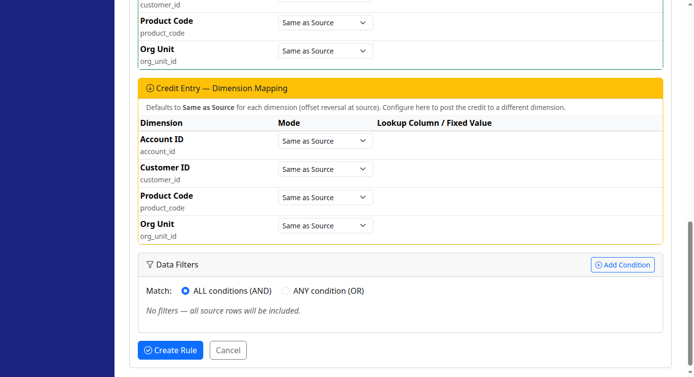
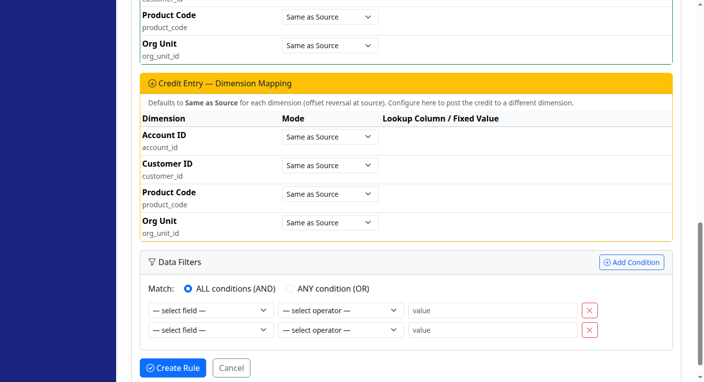
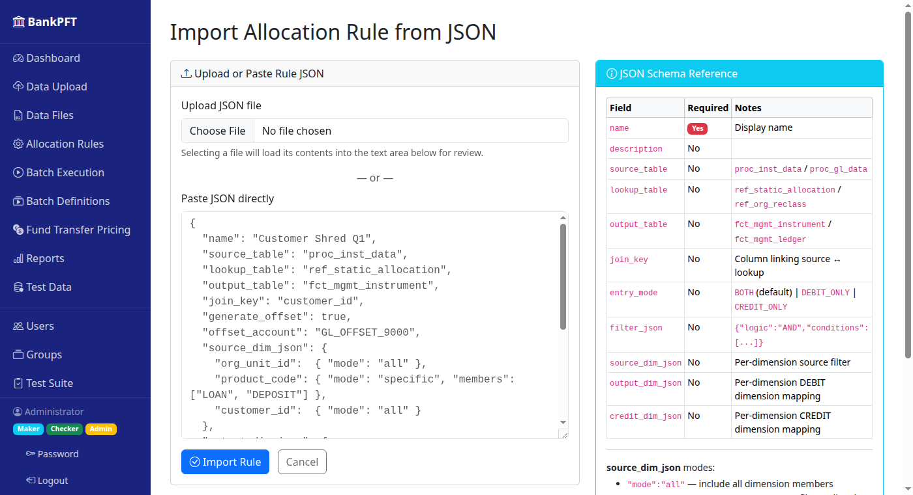
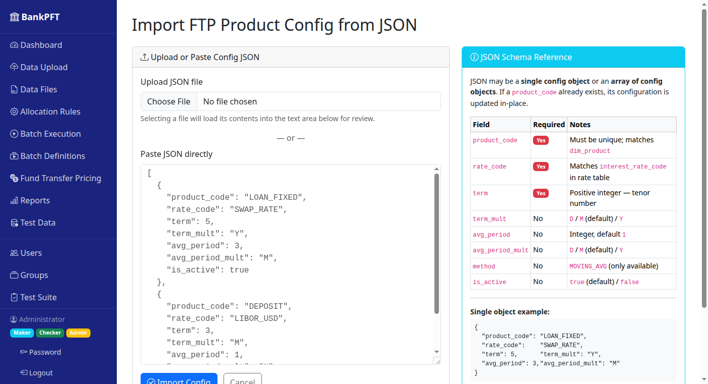
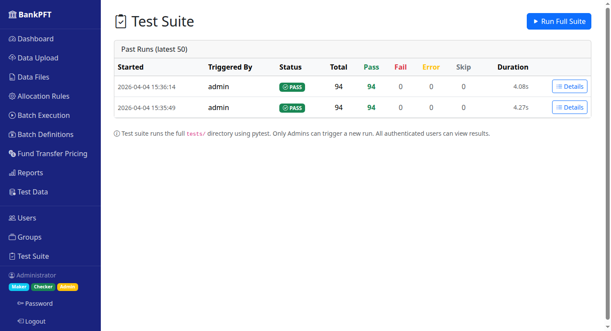
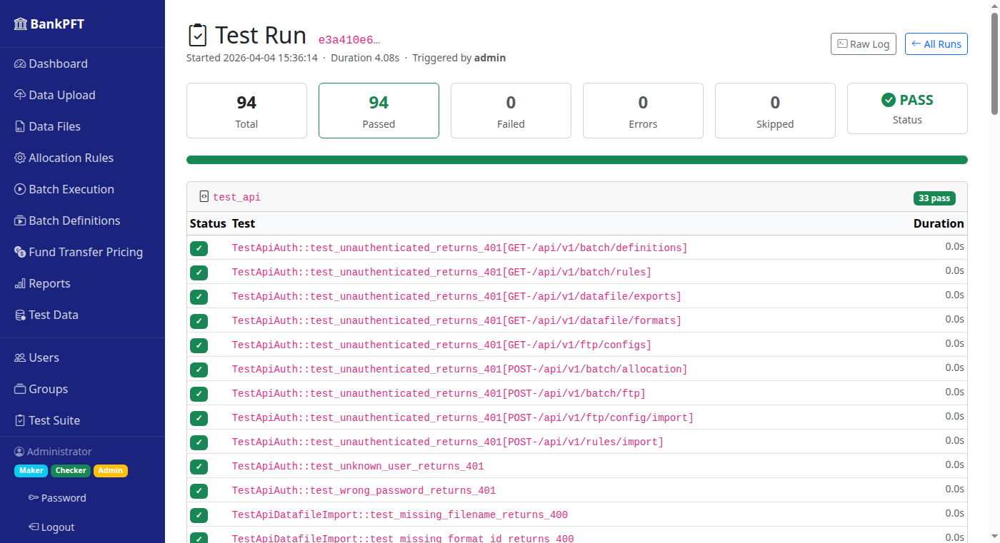
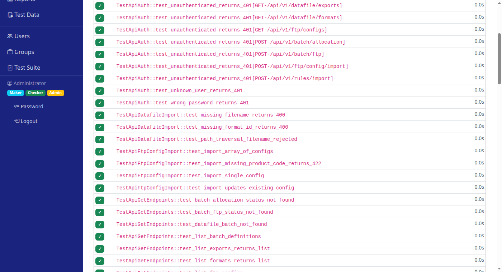

# BankPFT — Test Framework Manual

This document covers everything needed to understand, run, extend, and maintain the BankPFT regression test suite. It is intended for developers who are adding new features, fixing bugs, or onboarding to the codebase.

---

## Table of Contents

1. [Overview & Design Goals](#1-overview--design-goals)
2. [Quick Start](#2-quick-start)
3. [Test Architecture](#3-test-architecture)
4. [Fixtures Reference (`conftest.py`)](#4-fixtures-reference-conftestpy)
5. [Test Module Catalogue](#5-test-module-catalogue)
   - [test_auth.py](#51-test_authpy--authentication--access-control)
   - [test_rules.py](#52-test_rulespy--allocation-rules--engine)
   - [test_ftp_batch.py](#53-test_ftp_batchpy--ftp--batch--datafile)
   - [test_api.py](#54-test_apipy--rest-api-integration)
   - [test_ui.py](#55-test_uipy--browser-ui-tests)
6. [In-App Test Runner](#6-in-app-test-runner)
7. [Running Tests from the Command Line](#7-running-tests-from-the-command-line)
8. [Test Isolation & Database Strategy](#8-test-isolation--database-strategy)
9. [Adding Tests for New Features](#9-adding-tests-for-new-features)
10. [Adding Tests for New API Endpoints](#10-adding-tests-for-new-api-endpoints)
11. [CI/CD Integration](#11-cicd-integration)
12. [Troubleshooting](#12-troubleshooting)

---

## 1. Overview & Design Goals

The test framework was built to meet the following requirements for an enterprise financial calculation system:

| Goal | How it is achieved |
|---|---|
| **Regression protection** | 117 tests covering every engine, every API endpoint, the auth/permission system, and browser-level UI flows |
| **Test isolation** | Each unit test runs in an in-memory SQLite DB; rolled-back transactions mean tests never bleed state |
| **AI-generated code safety** | Tests run as part of every development cycle so new generated code is validated immediately |
| **In-app visibility** | Admins can trigger the suite and view per-test results from the browser at `/tests/` |
| **Browser UI coverage** | 23 Selenium headless-Chrome tests verify login, navigation, the filter editor, file-upload forms, and admin pages |
| **Pluggable** | Adding a `tests/test_<feature>.py` is all that is required — pytest auto-discovers it |
| **Speed** | Unit tests run in ≈ 4 seconds; full suite (including UI) runs in ≈ 17 seconds |
| **No production impact** | Tests never touch `instance/bankpft.db`; the app's live data is never read or written |

---

## 2. Quick Start

### Prerequisites

```bash
# Activate the project virtualenv
source venv/bin/activate

# Confirm test packages are installed
pip install pytest pytest-json-report selenium webdriver-manager
# (or: pip install -r requirements.txt)
```

For UI tests, Chrome must also be installed. `webdriver-manager` downloads the matching chromedriver automatically on first run. If no chromedriver is found, UI tests are **automatically skipped** — unit tests still run normally.

### Run the full suite

```bash
python -m pytest tests/ -q
```

Expected output (clean run):

```
...............................................................................................
117 passed, 154 warnings in 17.42s
```

To run only unit tests (no browser required):

```bash
python -m pytest tests/ --ignore=tests/test_ui.py -q
```

Expected output (unit tests only):

```
..............................................................................................
94 passed, 154 warnings in 4.13s
```

To run only UI tests:

```bash
python -m pytest tests/test_ui.py -v
```

### Run with verbose output

```bash
python -m pytest tests/ -v
```

### Run a single module

```bash
python -m pytest tests/test_api.py -v
```

### Run a single test class

```bash
python -m pytest tests/test_rules.py::TestApplyFilters -v
```

### Run a single test

```bash
python -m pytest tests/test_auth.py::TestLogin::test_successful_login_redirects_to_dashboard -v
```

### Stop on first failure

```bash
python -m pytest tests/ -x -v
```

---

## 3. Test Architecture

```
tests/
├── __init__.py              ← makes tests/ a Python package
├── conftest.py              ← all shared pytest fixtures (unit + UI)
├── test_auth.py             ← login, logout, access control, User/Group model
├── test_rules.py            ← AllocationRule CRUD, filter engine, allocation E2E
├── test_ftp_batch.py        ← FTP config, lookback math, FTP engine, batch, datafile
├── test_api.py              ← all /api/v1/ endpoints
└── test_ui.py               ← 23 Selenium headless-Chrome browser tests

pytest.ini                   ← registers the `ui` custom mark

app/
├── models/
│   └── test_run.py          ← TestSuiteRun model (persists run history)
├── routes/
│   └── tests.py             ← /tests/ blueprint (list, trigger, detail, log)
├── services/
│   └── test_runner.py       ← subprocess pytest invocation + JSON report parsing
└── templates/
    └── tests/
        ├── index.html       ← run history list + "Run Full Suite" button
        └── detail.html      ← per-test results grouped by module
```

### Technology choices

| Component | Choice | Reason |
|---|---|---|
| Test runner | pytest | Industry standard; auto-discovery; rich plugin ecosystem |
| JSON reports | pytest-json-report | Structured per-test output parsed by the in-app runner |
| Test database | `sqlite:///:memory:` | Zero I/O, always clean, supported by SQLAlchemy |
| HTTP testing | Flask test client | Built into Flask; no running server required |
| Browser testing | Selenium + headless Chrome | Industry standard; `webdriver-manager` auto-downloads chromedriver |
| Auth in tests | Form POST login / Basic Auth header | Tests the real auth path, not a mock |

---

## 4. Fixtures Reference (`conftest.py`)

All fixtures are defined in `tests/conftest.py`. They use pytest's dependency injection — just declare a fixture name as a function parameter.

### `app` (session-scoped)

Creates a Flask application with `TestConfig` (in-memory SQLite, CSRF disabled, testing mode). Created **once** per pytest session for speed.

```python
def test_something(app):
    with app.app_context():
        # access SQLAlchemy models, services, etc.
        pass
```

### `db` (session-scoped)

Calls `db.create_all()` on the test app context. All tables are created once for the session, then dropped at the end. Rarely used directly — use `db_session` instead.

### `db_session` (function-scoped)

Provides an isolated SQLAlchemy session wrapped in a transaction that is **rolled back** after each test. This is the key fixture for database isolation.

```python
def test_insert_something(db_session, app):
    from app.models.workflow import AllocationRule
    with app.app_context():
        rule = AllocationRule(name="My Rule", created_by="admin")
        db_session.add(rule)
        db_session.flush()
        assert rule.id is not None
    # Transaction is rolled back after test — no data persists
```

### `client` (function-scoped)

An **unauthenticated** Flask test client. Use this for testing redirects to login, public endpoints, or 401 responses.

```python
def test_redirect(client):
    rv = client.get("/rules/", follow_redirects=False)
    assert rv.status_code == 302
```

### `auth_client` (function-scoped)

A Flask test client that has been **logged in as `admin`** via a form POST. Use this for testing UI routes that require `@login_required`.

```python
def test_admin_page(auth_client):
    rv = auth_client.get("/admin/users")
    assert rv.status_code == 200
```

### `auth_headers` (function-scoped)

Returns a dict with a pre-encoded `Authorization: Basic admin:admin` header for use with API calls.

```python
def test_api_call(client, auth_headers):
    rv = client.get("/api/v1/batch/rules", headers=auth_headers)
    assert rv.status_code == 200
```

### `seeded_db` (function-scoped)

Builds on `db_session` and inserts minimal master data required for engine-level tests:

| What is seeded | Details |
|---|---|
| Groups | Admins, Makers, Checkers |
| Users | `admin` (Admins group) |
| Dimensions | `ORG-001`, `ORG-002`, `PROD-LON`, `CUST-0001`, `ACC-0001` |
| ProcInstData | One row for `ACC-0001` on `2026-01-01`, balance=100,000 |
| RefStaticAllocation | `CUST-0001` → `ORG-002` at 40%, status=APPROVED |
| RefInterestRate | `SWAP_RATE` 5Y at 4%, effective `2026-01-01`, status=APPROVED |
| FtpProductConfig | `PROD-LON` → MOVING_AVG, SWAP_RATE 5Y, 1M lookback |

```python
def test_engine(seeded_db, app):
    from app.services.allocation_engine import run_allocation
    with app.app_context():
        # seeded_db is the db_session with data already in it
        ...
```

### `TestConfig` class

Defined inside `conftest.py`. Inherits from `app.config.Config` and overrides:

```python
class TestConfig(Config):
    TESTING = True
    SQLALCHEMY_DATABASE_URI = "sqlite:///:memory:"
    WTF_CSRF_ENABLED = False
    SECRET_KEY = "test-secret-key"
```

---

### UI Fixtures (Selenium)

The following fixtures support the 23 browser tests in `test_ui.py`. They require `selenium>=4.0`, `webdriver-manager>=4.0`, and a locally installed Chrome browser.

#### `UITestConfig` class

A Flask configuration class with a **temp-file** SQLite database (not in-memory). This is required because the live Werkzeug server runs in a separate daemon thread and SQLite's in-memory database cannot be shared across threads. `check_same_thread=False` allows it to serve requests while tests drive the browser.

```python
class UITestConfig(Config):
    TESTING = True
    SQLALCHEMY_DATABASE_URI = f"sqlite:///{tmpfile}?check_same_thread=False"
    WTF_CSRF_ENABLED = False
    SECRET_KEY = "ui-test-secret"
```

The temp file is automatically deleted on session teardown.

#### `live_server` (session-scoped)

Starts a real Werkzeug HTTP server on `127.0.0.1:5099` in a daemon thread. Yields the base URL (`http://127.0.0.1:5099`). Creates all SQLAlchemy tables and seeds the `admin` user before yielding.

```python
def test_something(live_server):
    print(live_server)   # "http://127.0.0.1:5099"
```

Automatically **skips all UI tests** if chromedriver is not found on PATH or in `~/.wdm/` (the webdriver-manager cache).

#### `browser` (session-scoped)

Provides a headless Chrome `WebDriver` instance with a 1280×800 window. Depends on `live_server`. Created once per session and closed on teardown.

```python
def test_page(browser, live_server):
    browser.get(live_server + "/auth/login")
    assert "Login" in browser.title
```

#### `logged_in_browser` (session-scoped)

Depends on `browser` and `live_server`. Navigates to `/auth/login`, fills in `username=admin` / `password=admin`, submits the form, and yields the browser with an active session cookie. All subsequent `browser.get()` calls in the same session see the admin session.

```python
def test_admin_page(logged_in_browser, live_server):
    logged_in_browser.get(live_server + "/admin/users")
    assert logged_in_browser.find_element(By.TAG_NAME, "table")
```

**Note:** Because the browser and server are session-scoped, all UI tests share the same browser instance and login session. Tests must not log out or perform actions that invalidate the session.

---

## 5. Test Module Catalogue

### 5.1 `test_auth.py` — Authentication & Access Control

**Purpose:** Verify that Flask-Login, the login form, and route guards work correctly end-to-end.

| Class | Tests | Description |
|---|---|---|
| `TestLogin` | 5 | Login page renders; successful login redirects away from login; wrong password stays on login; unknown user stays on login; logout redirects to login |
| `TestAccessControl` | 5 | Parameterized over 5 protected routes — unauthenticated `GET` returns `302` to `/auth/login` |
| `TestUserModel` | 4 | Password hashing and `check_password()`; `repr` contains username; `is_admin` property from group membership; Group permission flags |
| `TestAdminRoutes` | 4 | `/admin/users` and `/admin/groups` redirect unauthenticated users; admin can view both pages |

**Key assertions:**
- `302` redirect location contains `"login"` for every protected route
- `check_password("correct")` is `True`; `check_password("wrong")` is `False`
- Admin user's `is_admin` property reflects group membership, not a user-level flag

---

### 5.2 `test_rules.py` — Allocation Rules & Engine

**Purpose:** Cover the AllocationRule model, the rule UI routes, the `_apply_filters()` engine helper, and the full allocation engine end-to-end.

#### `TestAllocationRuleModel` (3 tests)

| Test | Asserts |
|---|---|
| `test_create_minimal_rule` | Rule inserted with auto-id; `is_active=True`; `status="ACTIVE"`; `entry_mode="BOTH"` |
| `test_rule_repr_contains_name` | `name` attribute accessible |
| `test_default_tables` | Default `source_table`, `lookup_table`, `output_table` values from model defaults |

#### `TestAllocationRuleRoutes` (5 tests)

| Test | Asserts |
|---|---|
| `test_rules_list_requires_auth` | `302` for unauthenticated request |
| `test_rules_list_renders` | `200` for admin |
| `test_import_page_renders` | `200` for `/rules/import` |
| `test_import_valid_rule_json` | `200` or `302` (redirect to detail) on good JSON |
| `test_import_missing_name_shows_error` | `200` (stays on form) when name is absent |

#### `TestApplyFilters` (7 tests)

Direct unit tests for `app.services.allocation_engine._apply_filters()`:

| Test | Filter | Asserts |
|---|---|---|
| `test_no_filter_returns_all_rows` | `None` | All 3 rows returned |
| `test_eq_filter` | `product_code eq LOAN` | 2 LOAN rows |
| `test_gt_filter` | `balance gt 900` | 2 rows (1000 + 2000) |
| `test_in_filter` | `product_code in LOAN,DEPOSIT` | All 3 rows |
| `test_or_logic` | LOAN OR ORG-002 | All 3 rows |
| `test_invalid_json_returns_df_unchanged` | `{not valid json}` | All 3 rows unchanged |
| `test_between_filter` | `balance between 600,1500` | 1 row (1000) |

#### `TestAllocationEngine` (3 tests)

Full engine tests using `seeded_db`:

| Test | Asserts |
|---|---|
| `test_run_allocation_creates_batch` | `BatchRun` created, `status="COMPLETED"`, `source_row_count >= 1` |
| `test_run_allocation_unknown_rule_raises` | `ValueError` with "not found" for rule_id=999999 |
| `test_debit_credit_balance_equals_source` | Sum of all DEBIT `allocated_balance` + sum of all CREDIT `allocated_balance` ≈ 0 (CREDIT rows are stored as negative) |

---

### 5.3 `test_ftp_batch.py` — FTP, Batch Definitions & Datafile

#### `TestFtpProductConfig` (2 tests)

| Test | Asserts |
|---|---|
| `test_create_config` | Config inserted with auto-id; `method="MOVING_AVG"` default |
| `test_product_code_unique` | `IntegrityError` on duplicate `product_code` |

#### `TestFtpRoutes` (7 tests)

| Route | Test |
|---|---|
| `GET /ftp/` | Requires login; renders for admin |
| `GET /ftp/config` | Renders for admin |
| `GET /ftp/config/new` | Form renders |
| `GET /ftp/config/import` | Import page renders |
| `POST /ftp/config/import` (single JSON) | `200` on success |
| `POST /ftp/config/import` (array JSON) | `200` on success |

#### `TestLookbackStart` (4 tests)

Direct tests for `app.services.ftp_engine._lookback_start()`:

| Test | Input | Expected |
|---|---|---|
| `test_day_lookback` | `2026-03-15`, 10D | `2026-03-05` |
| `test_month_lookback` | `2026-03-31`, 1M | `2026-02-28` (clamps to Feb) |
| `test_month_lookback_across_year` | `2026-02-15`, 3M | `2025-11-15` |
| `test_year_lookback` | `2026-06-30`, 1Y | `2025-06-30` |

#### `TestFtpEngine` (4 tests)

| Test | Asserts |
|---|---|
| `test_run_ftp_returns_run_record` | `FtpRun` returned, `status="COMPLETED"` |
| `test_run_ftp_matches_instrument_with_config` | `instruments_processed >= 1`, `instruments_matched >= 1` |
| `test_run_ftp_writes_base_rate` | `ProcInstData.base_rate` is not None; `cost_of_fund > 0` |
| `test_run_ftp_no_instruments_completes_clean` | Zero-instrument run on far-future date completes without error |

#### `TestBatchDefinition` (3 tests)

| Test | Asserts |
|---|---|
| `test_definition_model_create` | `BatchDefinition` inserted with auto-id |
| `test_definition_list_requires_auth` | `302` redirect for unauthenticated |
| `test_definition_list_renders` | `200` for admin |
| `test_definition_new_form_renders` | `200` for `/batch/definitions/new` |

#### `TestDatafileConfig` (4 tests)

| Test | Asserts |
|---|---|
| `test_datafile_config_has_formats` | `DATAFILE_CONFIG["formats"]` is non-empty |
| `test_all_formats_have_format_id` | Every entry in formats has `"format_id"` key |
| `test_datafile_config_has_exports` | `DATAFILE_CONFIG["exports"]` is non-empty |
| `test_import_nonexistent_format_raises` | `ValueError` for unknown format_id |

---

### 5.5 `test_ui.py` — Browser UI Tests

**Purpose:** Verify the application's HTML/JavaScript layer with a real headless Chrome browser. These tests cover page rendering, client-side interactivity (filter editor), form inputs, and navigation — functionality that Flask's test client cannot reach.

**Prerequisites:** Chrome + `pip install selenium webdriver-manager` (included in `requirements.txt`). Tests auto-skip if chromedriver is not available.

**Run:**
```bash
python -m pytest tests/test_ui.py -v
# or just the UI mark:
python -m pytest -m ui -v
```

| Class | Tests | Description |
|---|---|---|
| `TestUILogin` | 4 | Login page renders correctly; wrong password stays on login page; successful login redirects to dashboard; unauthenticated access to a protected route redirects to login |
| `TestUINavigation` | 7 | Sidebar contains expected nav links; Dashboard, Rules, FTP, Reports, Batch, and Test Suite pages all return `200` and load without error |
| `TestUITestSuiteIndex` | 2 | "Run Full Suite" button is present and enabled; informational text ("pytest", "Admin") is visible on the page |
| `TestUIFilterEditor` | 6 | Filter editor card renders; empty state shows "No filters" placeholder; "Add Condition" button inserts a new condition row; "Remove" (×) button removes a row; empty-state message hides after adding a row; AND/OR radio buttons are present and one is pre-selected |
| `TestUIFileUploadPages` | 2 | Rule Import page has a file `<input>` and a JSON textarea; FTP Config Import page has a file `<input>` and a JSON textarea |
| `TestUIAdminPages` | 2 | `/admin/users` renders a users table; `/admin/groups` renders a groups table |

**Total: 23 tests**

#### Key implementation notes

- All click interactions use `execute_script("arguments[0].click()")` instead of `.click()` to avoid `ElementClickInterceptedException` when elements are below the viewport fold.
- The filter editor tests navigate to `/rules/new` and interact with the JavaScript-rendered condition builder.
- Session-scoped fixtures mean all 23 tests share one browser + one login session for speed. Tests are ordered so no test invalidates the session.

---

## 5.6 UI Test Screenshots

### Filter Editor — Empty State



The **Data Filters** card on the New Rule form. When no conditions have been added, the card shows a "No filters" placeholder message. The AND/OR radio buttons and the **Add Condition** button are always visible.

---

### Filter Editor — With Condition Rows



After clicking **Add Condition** twice, two rows appear. Each row has a **Field** dropdown, an **Operator** dropdown, a **Value** input, and an **×** remove button. The empty-state placeholder is hidden.

---

### Rule Import Page



The `/rules/import` page allows an allocation rule to be loaded from a JSON file (file picker) or by pasting JSON directly into the textarea. Both inputs are tested by `TestUIFileUploadPages`.

---

### FTP Config Import Page



The `/ftp/config/import` page mirrors the rule import layout — a file picker for bulk upload and a JSON textarea for single-config paste. Both inputs are verified by `TestUIFileUploadPages`. All tests use the Flask test client with `Authorization: Basic` headers — no running server required.

#### `TestApiAuth` (11 tests)

Parameterized over 9 endpoints. Each must return `401` when:
- No `Authorization` header is provided
- Wrong password is used
- Unknown username is used

#### `TestApiGetEndpoints` (8 tests)

| Test | Asserts |
|---|---|
| `test_list_rules_returns_list` | `{"rules": [...]}` |
| `test_list_formats_returns_list` | `{"formats": [...]}`, each entry has `"format_id"` |
| `test_list_exports_returns_list` | `{"exports": [...]}` |
| `test_list_ftp_configs` | `{"configs": [...]}` |
| `test_list_batch_definitions` | `{"definitions": [...]}` |
| `test_batch_allocation_status_not_found` | `404` for nonexistent batch_id |
| `test_batch_ftp_status_not_found` | `404` for nonexistent run_id |
| `test_datafile_batch_not_found` | `404` for nonexistent batch_id |

#### `TestApiRuleImport` (3 tests)

| Test | Input | Expected |
|---|---|---|
| `test_import_valid_rule_returns_201` | Full valid JSON | `201`, response has `rule_id` and `name` |
| `test_import_missing_name_returns_400` | JSON without `"name"` | `400`, response has `"error"` key |
| `test_import_empty_body_returns_400` | Empty body | `400` |

#### `TestApiFtpConfigImport` (4 tests)

| Test | Input | Expected |
|---|---|---|
| `test_import_single_config` | Single config object | `200`, `imported + updated >= 1` |
| `test_import_array_of_configs` | Array of 2 configs | `200`, `imported + updated >= 1` |
| `test_import_updates_existing_config` | Same product_code twice | Second call returns `updated >= 1` |
| `test_import_missing_product_code_returns_422` | Config without `product_code` | `422` |

#### `TestApiDatafileImport` (3 tests)

Input validation — these don't require real files:

| Test | Expected |
|---|---|
| Missing `format_id` | `400` |
| Filename with `../` (path traversal) | `400` |
| Missing `filename` | `400` |

#### `TestApiRunAllocation` (2 tests)

| Test | Expected |
|---|---|
| Missing `rule_id` | `400` |
| Non-existent `rule_id` | `400`, `404`, or `422` |

#### `TestApiRunFtp` (2 tests)

| Test | Expected |
|---|---|
| `as_of_date` provided | `200` or `422` (depends on seeded data); response has `"run_id"` or `"error"` |
| No `as_of_date` (defaults to today) | Does not crash; `200` or `422` |

---

## 6. In-App Test Runner

The test runner allows admins to execute the full test suite and review results without using the terminal.

### Screen: Test Suite — Run History (`/tests/`)

**URL:** `http://localhost:5000/tests/`



**Key elements:**
- **Run Full Suite** button (top right, admin only) — triggers the full suite and redirects to the detail page when complete
- **Past Runs table** — each row shows start timestamp, who triggered the run, green `PASS` / red `FAIL` / yellow `ERROR` status badge, total/pass/fail/error/skip counts, and elapsed duration
- **Details** button — navigates to the per-test breakdown for that run

---

### Screen: Test Run Detail — Summary (`/tests/run/<id>`)

**URL:** `http://localhost:5000/tests/run/<run_id>`



**Key elements:**
- **Run ID** (first 8 characters shown), start time, duration, triggered-by in the header
- **Summary cards** — Total / Passed (green border) / Failed (red border on failure) / Errors / Skipped / Status (PASS icon)
- **100% green progress bar** — each segment colour maps to passed (green) / failed (red) / error (yellow) / skipped (grey)
- **Raw Log** button — opens pytest stdout in a new browser tab
- **All Runs** button — returns to the run history list
- **Module accordion** begins immediately below the progress bar, grouped by test file

---

### Screen: Test Run Detail — Per-Test Results (scrolled)



**Key elements:**
- Each module section shows a file name header (e.g. `test_api`) with a pass-count badge (`33 pass`)
- Every test row shows: green ✓ badge (or red ✗ on failure), full test ID (`Class::method[param]`), and duration in seconds
- Failed tests display the assertion error message inline, making it easy to diagnose without a terminal

---

### Architecture

```
Browser (admin user)
    │
    │  POST /tests/run
    ▼
app/routes/tests.py  (tests_bp blueprint)
    │
    │  calls run_test_suite(triggered_by)
    ▼
app/services/test_runner.py
    │
    │  subprocess.run([sys.executable, "-m", "pytest", tests/, --json-report, ...])
    │
    │  Reads instance/test_results/<run_id>.json
    │  Parses pytest-json-report output
    │
    │  Writes TestSuiteRun to database
    ▼
app/models/test_run.py   (TestSuiteRun SQLAlchemy model)
    │
    ▼
Redirect to /tests/run/<run_id>
    │
    ▼
app/routes/tests.py  GET /tests/run/<id>
    │
    │  calls get_run_tests(suite_run)
    │  → flat list of {node_id, module, test_name, outcome, duration, message}
    │
    ▼
app/templates/tests/detail.html
```

### Routes

| Method | URL | Auth | Description |
|---|---|---|---|
| `GET` | `/tests/` | Login required | List all past runs (latest 50) with status badges |
| `POST` | `/tests/run` | Admin only | Trigger a new run; blocks until complete; redirects to detail |
| `GET` | `/tests/run/<id>` | Login required | Per-test results, grouped by module; progress bar |
| `GET` | `/tests/run/<id>/log` | Login required | Raw pytest stdout (plain text, opens in new tab) |

### `TestSuiteRun` model

Stored in the `test_suite_run` table:

| Column | Type | Description |
|---|---|---|
| `id` | UUID string | Primary key (auto-generated) |
| `started_at` | DateTime | When the run was triggered |
| `completed_at` | DateTime | When the subprocess finished |
| `triggered_by` | String | Username of the admin who triggered it |
| `status` | String | `RUNNING` / `PASS` / `FAIL` / `ERROR` |
| `total` | Integer | Total test count from pytest summary |
| `passed` | Integer | Passed count |
| `failed` | Integer | Failed count |
| `error` | Integer | Error count (collection errors, crashes) |
| `skipped` | Integer | Skipped count |
| `duration_s` | Float | Wall-clock seconds for the full run |
| `results_json` | Text | Full pytest-json-report payload (per-test detail) |
| `stdout` | Text | Combined stdout + stderr (capped at 65 535 chars) |

### Report files

Pytest-json-report writes a temporary report file to:
```
instance/test_results/<run_id>.json
```
This file is parsed immediately after the run and the contents are stored in `TestSuiteRun.results_json`. The file itself is kept for debugging.

### Status determination

| Condition | Status |
|---|---|
| `failed == 0` and `error == 0` | `PASS` |
| `failed > 0` or `error > 0` | `FAIL` |
| No JSON report and subprocess exit code ≠ 0 | `ERROR` |
| Subprocess timeout (> 10 minutes) | `ERROR` |

---

## 7. Running Tests from the Command Line

### Basic usage

```bash
# Full suite, quiet
python -m pytest tests/ -q

# Full suite, verbose (shows each test name)
python -m pytest tests/ -v

# Stop on first failure, show locals
python -m pytest tests/ -x --tb=long -l

# Show slowest 10 tests
python -m pytest tests/ --durations=10

# Run only tests matching a keyword
python -m pytest tests/ -k "allocation"
python -m pytest tests/ -k "ftp and not engine"

# Run a specific class
python -m pytest tests/test_rules.py::TestApplyFilters

# Run with JSON report (same format as in-app runner)
python -m pytest tests/ --json-report --json-report-file=report.json -q
```

### Browser (UI) tests

```bash
# Run only browser tests (requires Chrome + webdriver-manager)
python -m pytest tests/test_ui.py -v
python -m pytest -m ui -v

# Run only unit tests (no browser required)
python -m pytest tests/ --ignore=tests/test_ui.py -q
python -m pytest -m "not ui" -q

# Skip UI tests in CI environments without Chrome
python -m pytest tests/ --ignore=tests/test_ui.py --tb=short -q
```

### Useful flags

| Flag | Effect |
|---|---|
| `-q` | Quiet — dots only, summary at end |
| `-v` | Verbose — one line per test |
| `-x` | Stop after first failure |
| `--tb=short` | Concise traceback (default in most CI) |
| `--tb=long` | Full traceback with locals |
| `-l` | Show local variable values in tracebacks |
| `--no-header` | Suppress pytest version header line |
| `-k "expr"` | Run tests matching keyword expression |
| `--collect-only` | List test IDs without running (useful to verify discovery) |

---

## 8. Test Isolation & Database Strategy

### Why in-memory SQLite?

The production database is a file at `instance/bankpft.db`. Tests use `sqlite:///:memory:` so:
1. No test data ever contaminates the production database.
2. Tests run at memory speed with no I/O.
3. The database starts clean every pytest session — no cleanup scripts needed.

### Transaction rollback pattern

The `db_session` fixture uses the following pattern to make each test independent:

```python
@pytest.fixture(scope="function")
def db_session(app, db):
    with app.app_context():
        connection = db.engine.connect()
        transaction = connection.begin()
        db.session.configure(bind=connection)   # bind session to this connection
        yield db.session
        db.session.remove()
        transaction.rollback()                   # ← discard all changes
        connection.close()
        db.session.configure(bind=None)          # restore default
```

**Result:** every `db_session.add()` / `db_session.flush()` in a test is visible within that test, but the transaction is never committed, so the next test starts with a clean slate.

### Session scope vs function scope

| Fixture | Scope | Why |
|---|---|---|
| `app` | Session | Flask app creation (blueprint registration, config loading) is expensive — do it once |
| `db` | Session | `db.create_all()` creates all tables once per session |
| `db_session` | Function | Each test gets a fresh rolled-back transaction |
| `client`, `auth_client` | Function | Depend on `db_session` → function-scoped |
| `seeded_db` | Function | Inserts data into `db_session` which is rolled back after each test |

### `seeded_db` isolation

Even though `seeded_db` adds rows (dimensions, instrument, allocation ratio, FTP config), those inserts are part of the same function-scoped transaction that gets rolled back. Two tests using `seeded_db` each see the same fresh data and neither sees the other's changes.

---

## 9. Adding Tests for New Features

### Step-by-step

**1. Create the test file**

```bash
touch tests/test_myfeature.py
```

**2. Import what you need from conftest fixtures**

No import is needed — fixtures are injected automatically by pytest. Just declare them as parameters:

```python
def test_something(client, db_session, app):
    ...
```

**3. Follow the class-per-concern pattern**

```python
class TestMyModelRoutes:
    def test_list_requires_auth(self, client):
        rv = client.get("/myfeature/", follow_redirects=False)
        assert rv.status_code in (302, 308)

    def test_list_renders_for_admin(self, auth_client):
        rv = auth_client.get("/myfeature/")
        assert rv.status_code == 200

class TestMyModel:
    def test_create_defaults(self, db_session, app):
        from app.models.myfeature import MyModel
        with app.app_context():
            obj = MyModel(name="test")
            db_session.add(obj)
            db_session.flush()
            assert obj.id is not None
            assert obj.status == "ACTIVE"   # check defaults

class TestMyService:
    def test_happy_path(self, seeded_db, app):
        from app.services.myservice import run_myservice
        with app.app_context():
            result = run_myservice(...)
            assert result.status == "COMPLETED"
```

**4. Run the new file**

```bash
python -m pytest tests/test_myfeature.py -v
```

**5. Run the full suite to check for regressions**

```bash
python -m pytest tests/ -q
```

### Checklist for new feature tests

- [ ] Route requires login → test unauthenticated redirect
- [ ] Route requires admin → test non-admin access returns 403
- [ ] Happy-path renders → assert `200`  
- [ ] Model defaults → `flush()` and check default column values
- [ ] Service happy-path → use `seeded_db` if data is needed
- [ ] Service error path → assert raises or returns error status
- [ ] Input validation → test missing required fields, invalid values

### Adding UI / browser tests

UI tests belong in `tests/test_ui.py` and use the `logged_in_browser` / `browser` / `live_server` session-scoped fixtures.

```python
import pytest
from selenium.webdriver.common.by import By
from selenium.webdriver.support.ui import WebDriverWait
from selenium.webdriver.support import expected_conditions as EC

@pytest.mark.ui
class TestMyPageUI:
    def test_page_renders(self, logged_in_browser, live_server):
        logged_in_browser.get(live_server + "/myfeature/")
        assert "My Feature" in logged_in_browser.title

    def test_button_click(self, logged_in_browser, live_server):
        logged_in_browser.get(live_server + "/myfeature/")
        btn = logged_in_browser.find_element(By.ID, "my-button")
        # Use execute_script to avoid ElementClickInterceptedException
        logged_in_browser.execute_script("arguments[0].click()", btn)
        result = WebDriverWait(logged_in_browser, 5).until(
            EC.presence_of_element_located((By.CSS_SELECTOR, ".result"))
        )
        assert result.is_displayed()
```

**UI test checklist:**
- [ ] Page loads without JS errors (check `browser.execute_script("return window.onerror")`)
- [ ] Key elements are present (`find_element` returns without `NoSuchElementException`)
- [ ] Interactive elements respond correctly (click, fill, submit)
- [ ] Error messages appear when expected
- [ ] Use `execute_script` for clicks on elements that may be off-screen
- [ ] Keep tests session-safe — do not log out or navigate away from the app domain

---

## 10. Adding Tests for New API Endpoints

Use the `_basic()` helper (defined inline in `test_api.py`) to build auth headers:

```python
import json
import base64

def _basic(username="admin", password="admin"):
    creds = base64.b64encode(f"{username}:{password}".encode()).decode()
    return {"Authorization": f"Basic {creds}", "Content-Type": "application/json"}
```

### Template

```python
class TestApiMyEndpoint:
    def test_unauthenticated_returns_401(self, client):
        rv = client.post("/api/v1/myendpoint", content_type="application/json")
        assert rv.status_code == 401

    def test_happy_path_returns_200(self, client):
        rv = client.post(
            "/api/v1/myendpoint",
            headers=_basic(),
            data=json.dumps({"required_field": "value"}),
        )
        assert rv.status_code == 200
        data = rv.get_json()
        assert "result_key" in data

    def test_missing_required_field_returns_400(self, client):
        rv = client.post(
            "/api/v1/myendpoint",
            headers=_basic(),
            data=json.dumps({}),           # empty body
        )
        assert rv.status_code == 400
        assert "error" in rv.get_json()

    def test_nonexistent_resource_returns_404(self, client):
        rv = client.get("/api/v1/myendpoint/99999", headers=_basic())
        assert rv.status_code == 404
```

### Auth guard test — add to `TestApiAuth.ENDPOINTS`

Open `tests/test_api.py` and add the new URL to the parameterized list:

```python
class TestApiAuth:
    ENDPOINTS = [
        # ... existing entries ...
        ("POST", "/api/v1/myendpoint"),
        ("GET",  "/api/v1/myendpoint/<resource_id>"),
    ]
```

---

## 11. CI/CD Integration

### GitHub Actions example

Create `.github/workflows/test.yml`:

```yaml
name: Tests

on:
  push:
    branches: [main, develop]
  pull_request:

jobs:
  test:
    runs-on: ubuntu-latest

    steps:
      - uses: actions/checkout@v4

      - name: Set up Python
        uses: actions/setup-python@v5
        with:
          python-version: "3.12"

      - name: Install dependencies
        run: |
          python -m venv venv
          source venv/bin/activate
          pip install -r requirements.txt

      - name: Run test suite
        run: |
          source venv/bin/activate
          python -m pytest tests/ --tb=short -q --json-report --json-report-file=report.json

      - name: Upload test report
        if: always()
        uses: actions/upload-artifact@v4
        with:
          name: pytest-report
          path: report.json
```

### pytest exit codes

| Code | Meaning |
|---|---|
| `0` | All tests passed |
| `1` | Some tests failed |
| `2` | Interrupted (e.g. keyboard Ctrl+C) |
| `3` | Internal error |
| `4` | CLI usage error |
| `5` | No tests collected |

Use exit code `0` as the CI pass/fail gate.

### Generating an HTML report (optional)

```bash
pip install pytest-html
python -m pytest tests/ --html=report.html --self-contained-html
```

---

## 12. Troubleshooting

### "No tests collected"

```
collected 0 items
```

- Confirm files are named `test_*.py` or `*_test.py`.
- Confirm test functions are named `test_*` and classes are named `Test*`.
- Run `python -m pytest tests/ --collect-only` to see what pytest finds.

### `ImportError` on test file

Usually a missing import or a circular import exposed during test collection.

```bash
python -m pytest tests/test_failing.py --import-mode=importlib -v
```

Check the import path carefully — tests import from `app.*` which requires the `app` package to be importable from the project root.

### `IntegrityError` between tests

The `db_session` rollback should prevent this, but if you are using `db_session.commit()` inside a test (rare), the transaction cannot be rolled back. Use `db_session.flush()` instead of `commit()` in tests — `flush()` makes data visible within the session without writing to disk.

### `DetachedInstanceError`

Happens when you access a lazy-loaded relationship outside the app context. Wrap model access in `with app.app_context():`:

```python
def test_something(app, db_session):
    with app.app_context():
        obj = MyModel.query.first()
        _ = obj.related_items   # access relationship HERE, inside context
```

### Flask test client session not persisting

`auth_client` logs in once per test function. If the session appears lost mid-test, ensure you are using `auth_client` (not creating a new `app.test_client()`) for subsequent requests.

### In-app runner shows "ERROR" status with no report

- Check `instance/test_results/` — if no `.json` file was created, pytest itself failed to start.
- Common cause: import error in a test file. Run `python -m pytest tests/ --collect-only` in the terminal to get the error directly.
- Check `TestSuiteRun.stdout` — the Raw Log link in the app shows the subprocess output.

### "sqlite3.OperationalError: table already exists"

This can happen if `db.create_all()` is called multiple times in the same process with conflicting schema. The session-scoped `db` fixture calls `create_all()` once. If you manually call it in a test, wrap it in `checkfirst=True`:

```python
db.create_all(checkfirst=True)
```

---

*For architecture context and feature documentation, see [README.md](../README.md) and [docs/WALKTHROUGH.md](WALKTHROUGH.md).*
