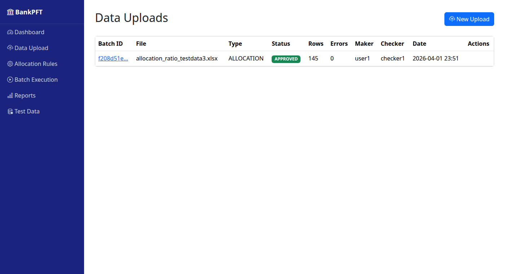
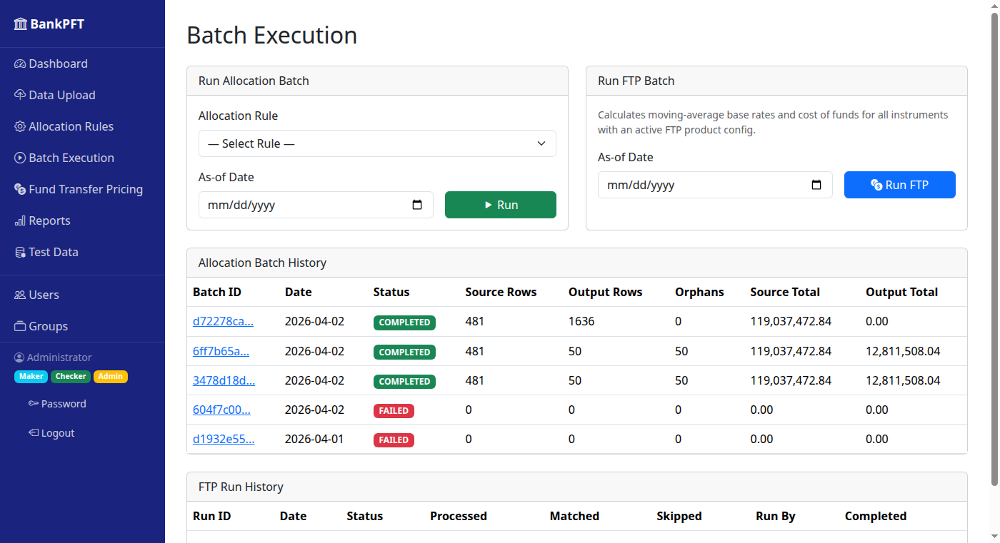

# BankPFT — Screen-by-Screen Walkthrough

This guide walks through every screen in the Management Allocation System, explaining what each page does and how to use it.

---

## Table of Contents

1. [Login](#1-login)
2. [Dashboard](#2-dashboard)
3. [Data Upload — List](#3-data-upload--list)
4. [Data Upload — New Upload](#4-data-upload--new-upload)
5. [Data Upload — Detail & Maker/Checker](#5-data-upload--detail--makechecker)
6. [Allocation Rules — List](#6-allocation-rules--list)
7. [Allocation Rules — New Rule](#7-allocation-rules--new-rule)
8. [Allocation Rules — Entry Mode](#8-allocation-rules--entry-mode)
9. [Allocation Rules — Source Dimension Filters](#9-allocation-rules--source-dimension-filters)
10. [Allocation Rules — Debit & Credit Dimension Mapping](#10-allocation-rules--debit--credit-dimension-mapping)
11. [Allocation Rules — Data Filter Editor](#11-allocation-rules--data-filter-editor)
12. [Allocation Rules — Detail](#12-allocation-rules--detail)
13. [Allocation Rules — Edit Rule](#13-allocation-rules--edit-rule)
14. [Allocation Rules — Import from JSON](#14-allocation-rules--import-from-json)
15. [Batch Execution](#15-batch-execution)
16. [Batch Execution — Detail](#16-batch-execution--detail)
17. [Fund Transfer Pricing — Dashboard](#17-fund-transfer-pricing--dashboard)
18. [Fund Transfer Pricing — Product Config](#18-fund-transfer-pricing--product-config)
19. [Fund Transfer Pricing — Interest Rates Browser](#19-fund-transfer-pricing--interest-rates-browser)
20. [Fund Transfer Pricing — Run Detail](#20-fund-transfer-pricing--run-detail)
21. [Reports — Index](#21-reports--index)
22. [Management Ledger Report](#22-management-ledger-report)
23. [Operations Report](#23-operations-report)
24. [Database Table Browser](#24-database-table-browser)
25. [Table Browser — Data View](#25-table-browser--data-view)
26. [Test Data Generator](#26-test-data-generator)
27. [User Management](#27-user-management)
28. [Group Management](#28-group-management)
29. [Starting the Application](#29-starting-the-application)
30. [PWA — Install as Standalone App](#30-pwa--install-as-standalone-app)
31. [Data File Management — Overview](#31-data-file-management--overview)
32. [Data File Management — Batch History](#32-data-file-management--batch-history)
33. [Data File Management — Batch Detail](#33-data-file-management--batch-detail)
34. [REST API — Overview](#34-rest-api--overview)
35. [REST API — Data File Endpoints](#35-rest-api--data-file-endpoints)
36. [REST API — Batch Endpoints](#36-rest-api--batch-endpoints)

---

## 1. Login

**URL:** `/auth/login`

The login page is displayed when accessing the system without authentication. All pages require a valid login.

**Key elements:**
- **Username** — enter your username
- **Password** — enter your password
- **Sign In** — authenticates and redirects to the Dashboard

**Default accounts** (password = username):

| Username | Role | Permissions |
|---|---|---|
| `admin` | Administrator | Make + Check + Admin |
| `maker1` | Maker | Create and submit uploads |
| `checker1` | Checker | Approve/reject uploads |

After login, the sidebar shows your display name, role badges (Maker/Checker/Admin), and links to change password or logout.

---

## 2. Dashboard

**URL:** `/`

The dashboard is the landing page. It provides a quick overview of the system's current state.


**Key elements:**
- **Summary cards** — counts of Recent Uploads, Active Rules, Batch Runs, and Ledger Records
- **Recent Uploads** — last uploaded files with status badges (DRAFT, PENDING, APPROVED, PROCESSED)
- **Recent Batch Runs** — latest allocation batch runs with row counts

Use the sidebar navigation on the left to reach any module. Admin users will see additional **Users** and **Groups** links.

---

## 3. Data Upload — List

**URL:** `/upload`

Shows all upload batches sorted by date, with their current workflow status.



**Key elements:**
- **File name** — links to the upload detail page
- **Type** — INSTRUMENT, GL, or ALLOCATION
- **Status** — current Maker/Checker workflow state
- **Rows / Errors** — row count and validation error count
- **Maker / Checker** — who uploaded and who approved
- **Delete** — available for DRAFT or REJECTED batches only

Click any file name to view details, or click **New Upload** to upload a file.

---

## 4. Data Upload — New Upload

**URL:** `/upload/new`

Upload an Excel (.xlsx) or CSV file for validation and staging.


**How to use:**
1. **Select Data Type** — choose from the dropdown (Instrument Data, General Ledger, Allocation Ratios). These options are driven by `upload_config.json`
2. **Choose File** — select a `.xlsx` or `.csv` file from your computer
3. **Click Upload & Validate** — the file is parsed, validated against configured rules, and staged. The logged-in user is automatically recorded as the Maker

**Expected Column Headers** — shown at the bottom of the page, generated automatically from the JSON config. Required columns are in bold; optional columns are shown in italics.

After upload, you are redirected to the detail page showing validation results.

---

## 5. Data Upload — Detail & Maker/Checker

**URL:** `/upload/<batch_id>`

Shows upload details, validation results, and the Maker/Checker workflow.


**Key elements:**
- **Workflow progress bar** — shows the current state: DRAFT → PENDING → APPROVED → PROCESSED
- **Batch info** — ID, type, status, row count, error count, maker, checker
- **Staged Data Preview** — first 20 rows of the uploaded data
- **Action buttons** (below preview, not shown):
  - **Submit for Review** — Maker submits (DRAFT → PENDING)
  - **Approve / Reject** — Checker reviews (PENDING → APPROVED or REJECTED)
  - **Process** — promotes staging data to processing tables (APPROVED → PROCESSED)

**4-Eyes Rule:** The Checker must be a different user than the Maker, and must belong to a group with the **Can Check** permission. The system enforces both constraints.

---

## 6. Allocation Rules — List

**URL:** `/rules`

Shows all allocation rules with their active/inactive status.


**Key elements:**
- **Rule name** — links to the rule detail page
- **Source / Lookup / Output tables** — the tables this rule operates on
- **Join Key** — the column used to match source data with allocation ratios
- **Status** — ACTIVE or INACTIVE
- **Edit** (pencil icon) — open the rule's edit form with all fields pre-populated
- **Toggle / Delete** — activate/deactivate or remove a rule

Rules are immediately active when created (no Maker/Checker workflow for rules).

---

## 7. Allocation Rules — New Rule

**URL:** `/rules/new`

Create a new allocation rule. The form is organised into five sections.


**How to use:**
1. **Rule Name / Description** — name and optional notes
2. **Source Table** — processed data table to read from
3. **Lookup Table** — allocation ratio table to join with
4. **Output Table** — where to write allocated results (`fct_mgmt_instrument` recommended)
5. **Join Key** — column linking source to lookup (e.g. `customer_id`)
6. **Entry Mode** — choose BOTH, Debit only, or Credit only (see section 8)
7. **Source Dimension Filters** — per-dimension member filter (see section 9)
8. **Debit & Credit Dimension Mapping** — per-dimension output value control (see section 10)
9. **Data Filters** — row-level filter conditions (see section 11)
10. **Click Create Rule** — saved immediately as ACTIVE

All dropdown options are driven by `rule_config.json`.

---

## 8. Allocation Rules — Entry Mode

**Location:** New Rule form — "Entry Mode" card

Controls which accounting entries the allocation engine generates for each matched row.

**Options:**

| Setting | Effect |
|---|---|
| **Both** (default) | Two rows per matched record: a **DEBIT** (target dimensions + positive balance) and a **CREDIT** (source/configured dimensions + negative balance) |
| **Debit only** | Single **DEBIT** row per matched record — balance moves to the target with no reversal |
| **Credit only** | Single **CREDIT** row per matched record — reversal posted without a corresponding debit entry |

**Example output for a 40% allocation, balance = 1000, mode = Both:**

| entry_type | account | org_unit | allocated_balance |
|---|---|---|---|
| DEBIT | ACT-001 | OU_TARGET | +400 |
| CREDIT | GL-CLR-8000 | OU_SOURCE | −400 |

> **Visibility:** Selecting **Debit only** hides the Credit Entry Dimension Mapping card. Selecting **Credit only** hides the Debit Entry Dimension Mapping card. **Both** shows both cards simultaneously.

---

## 9. Allocation Rules — Source Dimension Filters

**Location:** New Rule form — "Source Dimension Filters" card

For each dimension column in the selected source table, you can restrict which dimension members are included in the allocation run.

**Modes per dimension:**

| Mode | Behaviour |
|---|---|
| **All Members** (default) | All values of this dimension are included |
| **Specific Members** | Only rows whose dimension value appears in the comma-separated members list are included |

**Example — include only LOAN and DEPOSIT products:**

| Dimension | Mode | Members |
|---|---|---|
| Account ID | All Members | — |
| Customer ID | All Members | — |
| Product Code | Specific Members | `LOAN, DEPOSIT` |
| Org Unit | All Members | — |

Stored as `source_dim_json` in the database.

---

## 10. Allocation Rules — Debit & Credit Dimension Mapping

**Location:** New Rule form — "Debit Entry — Dimension Mapping" (green) and "Credit Entry — Dimension Mapping" (yellow) cards

Each entry type has its own independent dimension mapping table. The **Debit** card controls where allocated balances are posted; the **Credit** card controls where the equal-and-opposite reversal is posted. Card visibility follows the **Entry Mode** setting: the Debit card is hidden when **Credit only** is selected; the Credit card is hidden when **Debit only** is selected.

**Modes per dimension (same for both Debit and Credit):**

| Mode | Behaviour |
|---|---|
| **Same as Source** (default) | Copies the source dimension value to the output row |
| **From Lookup** | Reads the value from a column in the joined lookup table (e.g. `target_org_unit_id`) |
| **Fixed Value** | Writes a hardcoded value to every output row for this dimension |

**Typical configuration:**

*Debit — remap org to allocation target, keep other dimensions:*

| Dimension | Mode | Detail |
|---|---|---|
| Account ID | Same as Source | — |
| Org Unit | From Lookup | `target_org_unit_id` |
| Product Code | Same as Source | — |
| Customer ID | Same as Source | — |

*Credit — reverse at source org, post to GL clearing account:*

| Dimension | Mode | Detail |
|---|---|---|
| Account ID | Fixed Value | `GL-CLR-8000` |
| Org Unit | Same as Source | — |
| Product Code | Same as Source | — |
| Customer ID | Same as Source | — |

Debit mapping stored as `output_dim_json`; Credit mapping stored as `credit_dim_json`. Omitting `credit_dim_json` defaults all credit dimensions to **Same as Source**.

---

## 11. Allocation Rules — Data Filter Editor

**URL:** `/rules/new` (bottom of the form)

Row-level filter conditions that restrict which source rows are included when the allocation engine runs. Applied after source dimension filters.


**How to use:**
1. **Click "Add Condition"** — adds a new filter row
2. **Select Field** — dropdown shows filterable columns for the selected source table (from `filter_config.json`)
3. **Select Operator** — changes based on field type (string / numeric / date)
4. **Enter Value** — for `in`/`not in`, use comma-separated values; for `between`, use `min,max`
5. **Match Logic** — ALL conditions (AND) or ANY condition (OR)
6. **Remove** — click × to remove a condition

Filters are saved as JSON in `allocation_rule.filter_json` and applied at engine runtime.

---

## 12. Allocation Rules — Detail

**URL:** `/rules/<rule_id>`

View a rule's full configuration.


**Key elements:**
- Source / Lookup / Output table names
- **Entry Mode** badge — "DEBIT + CREDIT", "DEBIT only", or "CREDIT only"
- **Source Dimension Filters** card — shows mode and members per dimension
- **Debit Entry — Dimension Mapping** card (green) — shows mode and detail per dimension for DEBIT
- **Credit Entry — Dimension Mapping** card (yellow) — shows mode and detail per dimension for CREDIT; shows "same_as_source (default)" if not explicitly configured
- **Data Filters** card — shows saved filter conditions
- **Edit Rule** — opens the edit form with all fields pre-populated
- **Toggle / Delete** actions
- **Allocation ratios preview** — APPROVED ratios the rule would use

---

## 13. Allocation Rules — Edit Rule

**URL:** `/rules/<rule_id>/edit`

Edit all fields of an existing allocation rule. Accessible from:

- The **Edit** button (pencil icon) on the Rules List page
- The **Edit Rule** button in the Actions card on the Rule Detail page

**How to use:**

1. Open any rule from the list or detail page and click **Edit Rule**
2. All fields are pre-populated with the rule's current configuration
3. Dimension mapping tables (Source Filters, Debit Mapping, Credit Mapping) are rebuilt and restored to their saved state automatically
4. Data filter conditions are reloaded from the rule's saved filter configuration
5. Make any changes and click **Save Changes**

The rule is updated immediately and you are redirected back to the Detail page.

> **Note:** Editing a rule does not affect previously completed batch runs — historical results retain the configuration that was active at the time.

---

## 14. Allocation Rules — Import from JSON

**URL:** `/rules/import`

Create an allocation rule from a JSON file or pasted JSON text. Useful for version-controlling rule definitions or sharing configurations between environments.


**How to use:**
1. Click **Import JSON** from the Rules List page
2. Either **upload a `.json` file** or **paste JSON** into the text area
3. Click **Import Rule** — the rule is validated and saved

**Minimum required field:** `name`

**Full JSON schema:**

```json
{
  "name": "Customer Shred Q1",
  "description": "Optional notes",
  "source_table": "proc_inst_data",
  "lookup_table": "ref_static_allocation",
  "output_table": "fct_mgmt_instrument",
  "join_key": "customer_id",
  "entry_mode": "BOTH",
  "filter_json": {
    "logic": "AND",
    "conditions": [{"field": "product_code", "operator": "in", "value": "LOAN,DEPOSIT"}]
  },
  "source_dim_json": {
    "account_id":   {"mode": "all"},
    "org_unit_id":  {"mode": "all"},
    "product_code": {"mode": "specific", "members": ["LOAN", "DEPOSIT"]},
    "customer_id":  {"mode": "all"}
  },
  "output_dim_json": {
    "account_id":   {"mode": "same_as_source"},
    "org_unit_id":  {"mode": "lookup", "lookup_column": "target_org_unit_id"},
    "product_code": {"mode": "same_as_source"},
    "customer_id":  {"mode": "same_as_source"}
  },
  "credit_dim_json": {
    "account_id":   {"mode": "fixed", "value": "GL-CLR-8000"},
    "org_unit_id":  {"mode": "same_as_source"},
    "product_code": {"mode": "same_as_source"},
    "customer_id":  {"mode": "same_as_source"}
  }
}
```

Omitting `credit_dim_json` defaults all credit dimensions to **Same as Source**. Valid `entry_mode` values: `BOTH` (default), `DEBIT_ONLY`, `CREDIT_ONLY`.

### How the Rule Is Stored

After a successful import, the system redirects to the **Rule Detail** page. Every field from the JSON is persisted and displayed:


| Section | What is shown |
|---|---|
| **Header card** | ID, Name, Status (ACTIVE), Created By, Created timestamp |
| **Config row** | Source table, Lookup table, Output table, Entry Mode badge, Join Key(s) |
| **Description** | Free-text notes from the `description` field |
| **Source Dimension Filters** | One row per dimension — mode (`all` / `specific`) and any pinned members |
| **Debit Entry — Dimension Mapping** | Target dimension modes (`same_as_source`, `lookup`, `fixed`) with lookup column or fixed value |
| **Credit Entry — Dimension Mapping** | Same structure for the credit-side entry (only shown when `entry_mode` is `BOTH` or `CREDIT_ONLY`) |
| **Actions** | Edit Rule / Deactivate Rule / Delete Rule buttons |
| **Approved Allocation Ratios** | Pre-joined lookup rows that will be applied when the rule runs in a batch |

---

## 15. Batch Execution

**URL:** `/batch`

Run allocation rules or FTP calculations against processed data and view past run history.



The page is divided into two run panels side-by-side and two separate history tables below.

### Run Allocation Batch

1. **Select a Rule** — choose from active allocation rules
2. **As-of Date** — the date to filter source data
3. **Click Run** — executes the Pandas-based allocation engine

**What happens during execution:**
1. Source data is loaded from the configured table (filtered by date)
2. **Data filters** (`filter_json`) are applied — rows not matching are dropped
3. **Source dimension filters** (`source_dim_json`) are applied per dimension
4. Allocation ratios are loaded from the lookup table (APPROVED status only)
5. A LEFT JOIN matches source rows to ratios by the rule's join key
6. For each matched row: `allocated_balance = source_balance × ratio`
7. If **entry_mode** = **BOTH** or **DEBIT_ONLY**: **DEBIT entry** — output dimensions resolved per `output_dim_json`
8. If **entry_mode** = **BOTH** or **CREDIT_ONLY**: **CREDIT entry** — dimensions resolved per `credit_dim_json` (defaults to same-as-source), balance = negative
9. **Orphan rows** (no matching ratio) — DEBIT only at source org (`default_ratio` from config)

### Run FTP Batch

1. **As-of Date** — the calculation date
2. **Click Run FTP** — triggers the FTP moving-average engine

**What the FTP engine does:**
1. Loads all active `ftp_product_config` records
2. For each distinct product, queries `proc_inst_data` for instruments on the as-of date
3. Computes the moving-average `base_rate` from approved interest rate history over the lookback window
4. Writes `base_rate` and `cost_of_fund = balance × base_rate × (days_in_month / days_in_year)` back to each instrument row

The **Allocation Batch History** and **FTP Run History** tables are shown separately below the run forms.

---

## 16. Batch Execution — Detail

**URL:** `/batch/<batch_id>`

View the full results of a completed batch run, including a granular processing log written by the engine.


**Stats card fields:**

| Field | Description |
|---|---|
| **Batch ID** | UUID assigned to this run |
| **Status** | `RUNNING`, `COMPLETED`, or `FAILED` |
| **As-of Date** | The date used to filter source data |
| **Run By** | Username who triggered the batch |
| **Started** | Timestamp when the run began |
| **Source Rows** | Rows loaded from the source table after all filters |
| **Source Total** | Sum of the primary balance column from source data |
| **Output Rows** | Total rows written (DEBIT + CREDIT entries combined) |
| **Output Total** | Sum of allocated balances for DEBIT rows only |
| **Orphan Rows** | Source rows with no matching lookup ratio |
| **Variance** | `source_total − output_total` — should be 0 when ratios sum to 1.0 |

### Processing Log

Every engine run writes a timestamped log file to `instance/batch_logs/batch_<id>.log`. The full contents are displayed in a scrollable dark panel directly on the detail page.


**Log levels and what each line records:**

| Level | What is logged |
|---|---|
| `START` | Batch ID (first 8 chars) and user who triggered it |
| `RULE` | Rule name, source / lookup / output tables, entry mode, join key, dim config keys |
| `QUERY` | Table name and filter applied before each database read |
| `DATA` | Row count returned from each query |
| `FILTER` | Rows before → after each filter pass (data filter and source dim filter) |
| `JOIN` | Join key and type, plus matched vs orphan counts after the merge |
| `PROCESS` | Matched row count, emit flags, and final DEBIT / CREDIT entry counts |
| `ORPHAN` | Orphan row count and the default ratio applied |
| `DB` | Number of rows written to the output table |
| `SUMMARY` | Source rows, output rows, orphans, source total, output total, variance |
| `COMPLETE` | Total wall-clock time for the batch in seconds |
| `ERROR` / `FAILED` | Exception message if the run fails at any point |

The log file path (`batch_<id[:8]>.log`) is shown in the card header. Log files are stored at `instance/batch_logs/` and are never deleted automatically.

---

## 17. Fund Transfer Pricing — Dashboard

**URL:** `/ftp/`

The FTP dashboard is the entry point for all FTP operations.


**Key elements:**
- **Run FTP Calculation** form — select an as-of date and click **Run FTP** to trigger the engine
- **FTP Run History** table — lists past runs with status, instrument counts, and links to detail pages
- **FTP Config** button — navigate to the product config list
- **Interest Rates** button — open the rate browser
- **Upload Rates** button — shortcut to the Data Upload page (for uploading new rate files)

---

## 18. Fund Transfer Pricing — Product Config

**URL:** `/ftp/config`

Manage per-product FTP calculation parameters.


**Config form fields:**


| Field | Description |
|---|---|
| **Product Code** | Must match a product in `dim_product` (e.g. `PROD-LON`) |
| **Method** | Calculation method — currently only `MOVING_AVG` is supported |
| **Rate Code** | Interest rate code to look up in `ref_interest_rate` (e.g. `SWAP_RATE`) |
| **Term / Mult** | Tenor of the rate point to use (e.g. `5 Y` = 5-year rate) |
| **Avg Period / Mult** | Length of the moving-average window (e.g. `3 M` = 3-month average) |
| **Active** | Whether this config is used in FTP runs |

The FTP engine skips any instrument whose product code has no active config — those instruments appear in the **Skipped** count on the run detail.

---

## 19. Fund Transfer Pricing — Interest Rates Browser

**URL:** `/ftp/rates`

Browse uploaded and approved interest rates with filtering.


**Filters:** Date, Rate Code, Status (DRAFT / PENDING / APPROVED / REJECTED)

Rates are uploaded via the standard upload screen (Data Type: **Interest Rate**) and follow the DRAFT → PENDING → APPROVED workflow. Only APPROVED rates are used in FTP calculations.

**Expected Excel columns for Interest Rate upload:**

| Column | Type | Description |
|---|---|---|
| `effective_date` | date | Rate observation date |
| `interest_rate_code` | string | Rate identifier (e.g. `SWAP_RATE`) |
| `term` | integer | Tenor number (e.g. `3`) |
| `term_mult` | string | Tenor unit: D = day, M = month, Y = year |
| `rate` | float | Rate as decimal (e.g. `0.0535` = 5.35%) |

---

## 20. Fund Transfer Pricing — Run Detail

**URL:** `/ftp/run/<run_id>`

View details of a completed FTP run.


**Key elements:**
- Run metadata: as-of date, status, run by, timestamps
- **Instruments Processed** — total rows found for the as-of date
- **Instruments Matched** — rows where an active FTP config was found (base_rate/cost_of_fund written)
- **Instruments Skipped** — rows with no active FTP config for their product code
- Error message if the run failed

---

## 21. Reports — Index

**URL:** `/reports`

Hub page with links to all available reports.


**Available reports:**
- **Management Ledger** — aggregated allocation results
- **Operations Report** — system activity summary
- **Database Table Browser** — browse and edit any database table
- **Execution Log** — linked from batch detail pages

**Available reports:**
- **Management Ledger** — aggregated allocation results
- **Operations Report** — system activity summary
- **Database Table Browser** — browse and edit any database table
- **Execution Log** — linked from batch detail pages

---

## 22. Management Ledger Report

**URL:** `/reports/ledger`

The primary output report.


**How to use:**
1. **Group By** — choose a dimension: Org Unit, Product, Customer
2. **Batch Run** — filter to a specific batch or view all
3. **Click Filter** — refresh the results

**Results table shows:**
- Dimension value (e.g., `target_org_unit_id`)
- **Total Balance** — sum of allocated balances
- **Total Income** — sum of allocated interest income
- **Row Count** — number of output records in the group

> **Tip:** To see only the net movement (DEBIT entries), filter by `entry_type = DEBIT` using the Table Browser. The CREDIT entries are the equal-and-opposite offset that confirms no balance is created.

---

## 23. Operations Report

**URL:** `/reports/operations`

System activity and health overview.


**Key elements:**
- Upload activity by type and status
- Batch execution history
- Record counts across key tables
- System health indicators

---

## 24. Database Table Browser

**URL:** `/reports/tables`

Browse, search, and edit data in any database table.


**How to use:**
1. **Select a table** from the dropdown
2. **Click Browse** — view the table's data with pagination

All tables are listed, including `fct_mgmt_instrument` for DEBIT/CREDIT entries, `ref_interest_rate` for rate curves, `ftp_product_config` for FTP settings, and `ftp_run` for FTP run history.

> **Access control:** **Edit** and **Delete** row actions are visible only to Admin users.

---

## 25. Table Browser — Data View

**URL:** `/reports/tables?table=<table_name>`

View table data with pagination and inline editing.


**Key elements:**
- **Table selector** — switch between tables
- **Column headers** — all columns in the selected table
- **Data rows** — paginated (configurable page size)
- **Edit / Delete** — inline actions for each row (**Admin only**)
- **Pagination** — navigate through large tables

Useful for verifying dimension data, checking staged records, or inspecting DEBIT/CREDIT allocation entries.

---

## 26. Test Data Generator

**URL:** `/testdata`

Generate realistic test data for the system.


**Available generators:**

| Section | Generator | What it creates |
|---|---|---|
| Master Data | Generate Master Data | Dimension tables: Org Units, Products, Customers, Accounts |
| Instrument Data | Generate Instruments | 500+ instrument records in `proc_inst_data` (auto-approved) |
| Allocation Ratios | Generate Allocations (DB) | Allocation ratios for 10 customers, auto-approved |
| Allocation Ratios | Generate Alloc Ratio Test File | Excel file with 50 customers for upload testing |
| Excel Templates | Generate Templates | Blank Excel templates for all upload types (including Interest Rate) |
| FTP / Interest Rates | Generate Rate Data (DB) | 30 days × 3 codes × 4 tenors = 360 approved rows in `ref_interest_rate` |
| FTP / Interest Rates | Seed FTP Product Configs | FTP configs for PROD-LON, PROD-MTG, PROD-DEP, PROD-SAV, PROD-CRD |
| FTP / Interest Rates | Generate Rate Test File | `interest_rate_testdata.xlsx` (360 rows) for upload testing |

**Typical end-to-end setup:**
1. Generate **Master Data** (populates dimension tables)
2. Generate **Instruments** (seeds instrument records ready for allocation and FTP)
3. Generate **Allocations (DB)** (seeds approved allocation ratios)
4. Generate **Rate Data (DB)** (seeds 30 days of approved interest rates)
5. **Seed FTP Product Configs** (configures FTP engine per product)
6. Go to **Batch Execution** → Run Allocation + Run FTP

---

## 27. User Management

**URL:** `/admin/users` (Admin only)

Create, edit, and manage system users.

**Key elements:**
- **User list** — shows username, display name, group memberships, effective permissions, and active status
- **New User** — create a user with username, display name, password, and group assignments
- **Edit User** — change display name, reset password, toggle active status, reassign groups

**How to use:**
1. Click **New User**
2. Enter username, display name, and password
3. Select one or more groups
4. Click **Create User**

---

## 28. Group Management

**URL:** `/admin/groups` (Admin only)

Create and manage permission groups.

**Key elements:**
- **Group list** — shows name, description, permission flags, active status, and member count
- **New Group** — create a group with name, description, and permission checkboxes
- **Edit Group** — modify description, permissions, or active status

**Permission flags:**

| Flag | Effect |
|---|---|
| **Can Make** | Users in this group can create and submit uploads for review |
| **Can Check** | Users in this group can approve or reject uploads (4-Eyes Principle) |
| **Admin** | Users in this group can access `/admin` to manage users and groups |

A user’s effective permissions are the union of all their groups’ permissions.

---

## 29. Starting the Application

**Script:** `start.sh` in the project root

The `start.sh` script handles virtual environment creation, dependency installation, and server startup automatically.

### Commands

```bash
# Development server (default) — auto-creates venv, installs deps, starts Flask with debug
./start.sh
./start.sh dev

# Production daemon — starts Gunicorn in background (4 workers)
./start.sh prod

# Stop Gunicorn daemon
./start.sh stop

# Docker Compose (builds image and starts container)
./start.sh docker
```

### What `start.sh` Does

| Step | dev | prod |
|---|---|---|
| Create venv if missing | ✔ | ✔ |
| Install requirements.txt | ✔ | ✔ |
| Create `instance/` and `uploads/` dirs | ✔ | ✔ |
| Start Flask debug server (foreground) | ✔ | ✕ |
| Start Gunicorn daemon (background) | ✕ | ✔ |

> **Debug mode** is **disabled by default**. Set the `FLASK_DEBUG=1` environment variable only in development. In production, error pages show a friendly message instead of a stack trace.

---

## 30. PWA — Install as Standalone App

BankPFT ships a [Web App Manifest](https://developer.mozilla.org/en-US/docs/Web/Manifest) (`/static/manifest.json`) that enables installation as a standalone Progressive Web App. When launched from the desktop shortcut, the browser frame — including the address bar — is hidden.

**How to install:**

1. Open the app in **Chrome** or **Edge**
2. Look for the **install icon** (desktop icon or "+" symbol) in the address bar, or open the browser menu and select **"Install Management Allocation System"**
3. Click **Install** — a desktop shortcut is created
4. Launch from the shortcut — the app opens full-screen with no browser chrome

**Supported browsers:** Chrome 73+, Edge 79+, Samsung Internet 8.2+. Firefox does not support standalone display mode.

**Manifest settings:**

| Setting | Value |
|---|---|
| Display | `standalone` (no address bar) |
| Theme color | `#1a237e` (dark blue) |
| Start URL | `/` (Dashboard) |
| Icons | 192×192 and 512×512 PNG |
| Start Gunicorn daemon (background) | ✕ | ✔ |
| Write PID to `bankpft.pid` | ✕ | ✔ |
| Write logs to `bankpft.log` | ✕ | ✔ |

### Environment Variables

| Variable | Default | Effect |
|---|---|---|
| `WORKERS` | `4` | Number of Gunicorn worker processes |

**Example — production with 8 workers:**
```bash
WORKERS=8 ./start.sh prod
```

Open http://localhost:5000 after starting in any mode.

---

## End-to-End Workflow Summary

```
┌─────────────┐     ┌──────────────┐     ┌──────────────┐     ┌─────────────┐     ┌──────────────┐     ┌──────────────┐
│   Login      │────>│  Test Data   │────>│  Upload File │────>│   Approve    │────>│  Create Rule │────>│ Run Batch    │
│   (any user) │     │  Generator   │     │  (Maker)     │     │  (Checker)   │     │  (or Import) │     │ Allocation   │
└─────────────┘     └──────────────┘     └──────────────┘     └─────────────┘     └──────────────┘     └──────────────┘
                           │                                                                                      │
                           │ also seeds rate data                                                                 ▼
                           │ + FTP product configs                                                         ┌──────────────┐
                           ▼                                                                               │  View Ledger │
                    ┌──────────────┐     ┌──────────────┐     ┌──────────────┐                            │  Report      │
                    │Upload Interest│───>│ Approve Rates │───>│  Run FTP     │                            └──────────────┘
                    │ Rate File    │     │  (Checker)   │     │  (Batch page)│
                    └──────────────┘     └──────────────┘     └──────────────┘
                                                                      │
                                                                      ▼
                                                               ┌──────────────┐
                                                               │ FTP Run Dtl  │
                                                               │base_rate &   │
                                                               │cost_of_fund  │
                                                               └──────────────┘
```

1. **Start the app** — run `./start.sh` from the project root
2. **Login** as maker1 (or any user with Maker permissions)
3. **Generate** test data — master data, instruments, allocation ratios, interest rates, FTP configs
4. **Upload** files via Data Upload — validation runs automatically
5. **Login** as checker1 (different from the Maker) to approve uploads
6. **Create or import** an allocation rule with optional dimension filters, output mapping, and debit/credit offset
7. **Execute** an allocation batch run to shred balances using the rule
8. **Configure** FTP product configs (or use the seeded defaults from Test Data)
9. **Run FTP** from the Batch Execution page — computes base_rate and cost_of_fund per instrument
10. **Review** allocation results in the Management Ledger Report; FTP results in the FTP Run Detail or via the Table Browser (`proc_inst_data.base_rate`, `proc_inst_data.cost_of_fund`)

---

## 31. Data File Management — Overview

**URL:** `/datafile/`

Data File Management provides a JSON-configured batch file I/O engine for loading files from an **inbox** folder and writing output to an **outbox** folder. It operates independently of the Excel upload workflow and does not use the Maker/Checker process.

### File Format Support

| Format | Config key | Field mapping |
|---|---|---|
| Fixed-length | `"type": "fixed_length"` | Slice each field by `start` (byte offset) and `length` |
| Delimited | `"type": "delimited"` | Split by `delimiter`, map by `column` index or `use_header_names: true` |

Common delimiters: `","` (CSV), `"|"` (pipe), `"\t"` (tab), or any single character.

### Per-file Rule JSON

Each import or export is defined in its own JSON file under `app/config/datafile/`. The service scans the directory at startup and registers every file automatically.

**Import rule structure:**
```json
{
  "operation": "import",
  "format_id": "LOAN_FIXED",
  "name": "Loan File — Fixed Length",
  "description": "Fixed-width 120-char loan records.",
  "type": "fixed_length",
  "record_length": 120,
  "target_table": "stg_inst_data",
  "fields": [
    { "name": "account_id",    "start": 0,  "length": 12, "type": "string" },
    { "name": "branch_code",   "start": 12, "length": 4,  "type": "string",
      "transform": "concat('BR', lpad(value, 4, '0'))" },
    { "name": "balance",       "start": 16, "length": 14, "type": "decimal",
      "transform": "to_float(value) / 100" },
    { "name": "maturity_date", "start": 30, "length": 8,  "type": "date",
      "date_format": "YYYYMMDD" }
  ]
}
```

**Export rule structure:**
```json
{
  "operation": "export",
  "export_id": "INST_PROC_EXPORT",
  "name": "Processed Instruments Export",
  "source_table": "proc_inst_data",
  "format": "fixed_length",
  "fields": [
    { "name": "account_id",  "length": 20, "align": "left",  "pad": " " },
    { "name": "balance",     "length": 18, "align": "right", "pad": " " }
  ]
}
```

For delimited exports, set `"format": "delimited"`, `"delimiter": ","`, and optionally `"include_header": true`.

### Transform Expression Sandbox

The `transform` field on an import field is a safe expression evaluated at row load time. The variable `value` holds the raw (stripped) string from the file.

| Category | Available functions / syntax |
|---|---|
| String | `upper(v)`, `lower(v)`, `trim(v)`, `ltrim(v)`, `rtrim(v)`, `left(v,n)`, `right(v,n)`, `substr(v,s,e)`, `lpad(v,n,c)`, `rpad(v,n,c)`, `replace(v,old,new)`, `concat(a,b,...)`, `startswith(v,p)`, `endswith(v,p)`, `contains(v,p)` |
| Conditional | `iif(cond, a, b)`, `a if cond else b`, `nvl(v, default)`, `coalesce(a, b, ...)` |
| Conversion | `to_float(v)`, `to_int(v)` |
| Arithmetic | `+`, `-`, `*`, `/`, `//`, `%`, `**` |
| Slice | `value[0:5]` |

**Examples:**

| Transform expression | Input → Output |
|---|---|
| `concat('BR', lpad(value, 4, '0'))` | `'12'` → `'BR0012'` |
| `to_float(value) / 100` | `'25000000'` → `250000.0` |
| `upper(trim(value))` | `' loan '` → `'LOAN'` |
| `'DEBIT' if to_float(value) > 0 else 'CREDIT'` | `'500'` → `'DEBIT'` |
| `nvl(value, 'UNKNOWN')` | `''` → `'UNKNOWN'` |
| `value[0:8]` | `'20260101extra'` → `'20260101'` |

### Folder Paths

Configured in `app/config/datafile_config.json`:

```json
{
  "global": {
    "inbox_folder":  "uploads/inbox",
    "outbox_folder": "uploads/outbox"
  }
}
```

Place input files in `uploads/inbox/` before triggering an import (via UI or API). Export output files are written to `uploads/outbox/` with a timestamp suffix.

---

## 32. Data File Management — Batch History

**URL:** `/datafile/`

Lists all data file import and export runs in reverse chronological order.

**Columns:**

| Column | Description |
|---|---|
| **ID** | Short UUID (links to detail page) |
| **Operation** | `import` or `export` |
| **Format / Export ID** | The rule ID used (e.g. `LOAN_FIXED`, `INST_PROC_EXPORT`) |
| **File** | Source filename (import) or generated output filename (export) |
| **Target / Source Table** | Database table read from or written to |
| **Status** | `RUNNING`, `COMPLETED`, or `FAILED` |
| **Rows** | Number of rows processed |
| **Errors** | Number of row-level errors |
| **Run By** | Username who triggered the run |
| **Completed** | Timestamp |

Click any batch ID to view full details and per-row errors.

---

## 33. Data File Management — Batch Detail

**URL:** `/datafile/<batch_id>`

Full detail page for a single import or export run.

**Key sections:**

- **Summary card** — operation, format/export ID, status, filename, target table, row count, error count, run by, started/completed timestamps, and error message (if failed)
- **Row Errors** — table of per-row errors with row number, field name, raw value, and error description. Shown only when `error_count > 0`

Errors do not stop the import — rows with errors are skipped and the remaining rows are loaded. The batch status is `COMPLETED` unless a fatal error occurs.

---

## 34. REST API — Overview

**Base URL:** `/api/v1/`

All API endpoints use **HTTP Basic Auth** with existing user credentials. No session cookies or tokens are required. All request bodies and responses are JSON.

### Authentication

Add an `Authorization` header to every request:

```bash
curl -u admin:admin http://localhost:5000/api/v1/datafile/formats
```

Or construct the header manually:

```
Authorization: Basic <base64(username:password)>
```

**401 response** (invalid or missing credentials):
```json
{"error": "Unauthorized — provide valid credentials via HTTP Basic Auth"}
```

The response also includes a `WWW-Authenticate: Basic realm="BankPFT API"` header.

### HTTP Status Codes

| Code | Meaning |
|---|---|
| `200` | Success |
| `400` | Bad request — missing or invalid body field |
| `401` | Unauthorized — invalid or missing credentials |
| `404` | Resource not found |
| `422` | Run triggered but completed with errors (check `error_message` / `errors` field) |

### Available Endpoints

| Method | Endpoint | Description |
|---|---|---|
| `GET` | `/api/v1/datafile/formats` | List available import format IDs |
| `GET` | `/api/v1/datafile/exports` | List available export config IDs |
| `POST` | `/api/v1/datafile/import` | Trigger a file import |
| `POST` | `/api/v1/datafile/export` | Trigger a file export |
| `GET` | `/api/v1/datafile/batch/<id>` | Get import/export batch status |
| `GET` | `/api/v1/batch/rules` | List active allocation rules |
| `POST` | `/api/v1/batch/allocation` | Run an allocation batch |
| `GET` | `/api/v1/batch/allocation/<id>` | Get allocation batch status |
| `POST` | `/api/v1/batch/ftp` | Run the FTP calculation engine |
| `GET` | `/api/v1/batch/ftp/<id>` | Get FTP run status |

---

## 35. REST API — Data File Endpoints

### GET `/api/v1/datafile/formats`

Returns all registered import format definitions (loaded from `app/config/datafile/import_*.json`).

**Response:**
```json
{
  "formats": [
    {
      "format_id": "LOAN_FIXED",
      "name": "Loan File — Fixed Length",
      "description": "Fixed-width 120-char loan records.",
      "type": "fixed_length",
      "target_table": "stg_inst_data"
    }
  ]
}
```

---

### GET `/api/v1/datafile/exports`

Returns all registered export configurations (loaded from `app/config/datafile/export_*.json`).

**Response:**
```json
{
  "exports": [
    {
      "export_id": "INST_PROC_EXPORT",
      "name": "Processed Instruments Export",
      "description": "...",
      "format": "fixed_length",
      "source_table": "proc_inst_data"
    }
  ]
}
```

---

### POST `/api/v1/datafile/import`

Triggers a data file import. The file must already exist in the configured inbox folder.

**Request body:**
```json
{ "format_id": "LOAN_FIXED", "filename": "loan.dat" }
```

| Field | Required | Description |
|---|---|---|
| `format_id` | Yes | Must match a registered import rule |
| `filename` | Yes | Filename only (no path). File must be present in the inbox folder |

**Success response (`200`):**
```json
{
  "batch_id": "21ef93cb-b7af-4073-8c2f-8417b2a40f8d",
  "operation": "import",
  "format_id": "LOAN_FIXED",
  "filename": "loan.dat",
  "target_table": "stg_inst_data",
  "status": "COMPLETED",
  "row_count": 3,
  "error_count": 0,
  "errors": [],
  "error_message": null,
  "run_by": "admin",
  "started_at": "2026-01-01T09:00:00Z",
  "completed_at": "2026-01-01T09:00:01Z"
}
```

If rows were loaded but some had field errors, the response returns `422` with `error_count > 0` and an `errors` list (up to 20 entries):

```json
{
  "status": "COMPLETED",
  "row_count": 10,
  "error_count": 2,
  "errors": [
    { "row": 3, "field": "balance", "raw_value": "INVALID", "error": "cannot convert to float" }
  ]
}
```

---

### POST `/api/v1/datafile/export`

Triggers a data file export. Output is written to the outbox folder.

**Request body:**
```json
{ "export_id": "INST_PROC_EXPORT", "as_of_date": "2026-01-01" }
```

| Field | Required | Description |
|---|---|---|
| `export_id` | Yes | Must match a registered export rule |
| `as_of_date` | No | `YYYY-MM-DD` — filter source data by date. Defaults to today |

**Success response (`200`):**
```json
{
  "batch_id": "8f1e1f89-62d0-4baa-b6d9-39a74eae20f3",
  "operation": "export",
  "format_id": "INST_PROC_EXPORT",
  "filename": "INST_PROC_EXPORT_20260101_090000.dat",
  "status": "COMPLETED",
  "row_count": 55,
  "error_count": 0,
  "errors": [],
  "started_at": "2026-01-01T09:00:00Z",
  "completed_at": "2026-01-01T09:00:01Z"
}
```

---

### GET `/api/v1/datafile/batch/<batch_id>`

Returns the current status of any data file batch (import or export).

**Example:**
```bash
curl -u admin:admin http://localhost:5000/api/v1/datafile/batch/21ef93cb-b7af-4073-8c2f-8417b2a40f8d
```

Response shape is identical to the `POST /import` or `POST /export` response.

---

## 36. REST API — Batch Endpoints

### GET `/api/v1/batch/rules`

Returns all active allocation rules.

**Response:**
```json
{
  "rules": [
    {
      "rule_id": 1,
      "name": "Customer Shred — Static Alloc",
      "description": "Shred instrument balances by customer ratio.",
      "source_table": "proc_inst_data",
      "lookup_table": "ref_static_allocation",
      "output_table": "fct_mgmt_instrument"
    }
  ]
}
```

---

### POST `/api/v1/batch/allocation`

Runs an allocation batch synchronously and returns the result.

**Request body:**
```json
{ "rule_id": 1, "as_of_date": "2026-01-01" }
```

| Field | Required | Description |
|---|---|---|
| `rule_id` | Yes | Integer ID of an active allocation rule |
| `as_of_date` | No | `YYYY-MM-DD` — defaults to today |

**Success response (`200`):**
```json
{
  "batch_id": "a1b2c3d4-...",
  "rule_id": 1,
  "as_of_date": "2026-01-01",
  "status": "COMPLETED",
  "source_row_count": 120,
  "output_row_count": 240,
  "orphan_count": 0,
  "source_total": 5000000.0,
  "output_total": 5000000.0,
  "run_by": "admin",
  "error_message": null,
  "started_at": "2026-01-01T09:00:00Z",
  "completed_at": "2026-01-01T09:00:02Z"
}
```

**If the rule is not found or inactive → `404`:**
```json
{ "error": "rule_id 99 not found or inactive" }
```

---

### GET `/api/v1/batch/allocation/<batch_id>`

Returns the status of a previously triggered allocation batch. Same response shape as `POST /batch/allocation`.

---

### POST `/api/v1/batch/ftp`

Runs the FTP moving-average engine for a given as-of date.

**Request body:**
```json
{ "as_of_date": "2026-01-01" }
```

| Field | Required | Description |
|---|---|---|
| `as_of_date` | No | `YYYY-MM-DD` — defaults to today |

**Success response (`200`):**
```json
{
  "run_id": "f0a1b2c3-...",
  "as_of_date": "2026-01-01",
  "status": "COMPLETED",
  "instruments_processed": 500,
  "instruments_matched": 480,
  "instruments_skipped": 20,
  "run_by": "admin",
  "error_message": null,
  "started_at": "2026-01-01T09:00:00Z",
  "completed_at": "2026-01-01T09:00:03Z"
}
```

---

### GET `/api/v1/batch/ftp/<run_id>`

Returns the status of a previously triggered FTP run. Same response shape as `POST /batch/ftp`.

---

### curl Quick Reference

```bash
BASE=http://localhost:5000
AUTH="-u admin:admin"

# List available import formats
curl $AUTH $BASE/api/v1/datafile/formats

# Trigger a file import
curl $AUTH -X POST -H 'Content-Type: application/json' \
  -d '{"format_id":"LOAN_FIXED","filename":"loan.dat"}' \
  $BASE/api/v1/datafile/import

# Trigger a file export
curl $AUTH -X POST -H 'Content-Type: application/json' \
  -d '{"export_id":"INST_PROC_EXPORT","as_of_date":"2026-01-01"}' \
  $BASE/api/v1/datafile/export

# List active allocation rules
curl $AUTH $BASE/api/v1/batch/rules

# Run an allocation batch
curl $AUTH -X POST -H 'Content-Type: application/json' \
  -d '{"rule_id":1,"as_of_date":"2026-01-01"}' \
  $BASE/api/v1/batch/allocation

# Run FTP
curl $AUTH -X POST -H 'Content-Type: application/json' \
  -d '{"as_of_date":"2026-01-01"}' \
  $BASE/api/v1/batch/ftp

# Poll status
curl $AUTH $BASE/api/v1/datafile/batch/<batch_id>
curl $AUTH $BASE/api/v1/batch/allocation/<batch_id>
curl $AUTH $BASE/api/v1/batch/ftp/<run_id>
```
